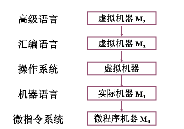
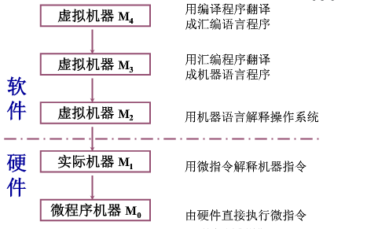

# 计算机系统简介
- 计算机系统的软硬件概念
  * 计算机系统
    - 硬件 计算机的实体 如主机、外设等
    - 软件 由具有各类特殊功能的信息（程序）组成
        * 系统软件
        * 应用软件

- 计算机系统的层次结构
    * 系统复杂性管理的方法
        - 抽象

    

    

- 计算机组成与计算机体系结构从研究内容上来说有什么区别？

    * 计算机体系结构
        * 程序员所见到的计算机系统的属性概念性的结构与功能特性
            - 指令系统
            - 数据类型
            - 寻址技术
            - I/O 机理
    * 计算机组成
        * 实现计算机体系结构所体现的属性
            * 具体指令的实现
