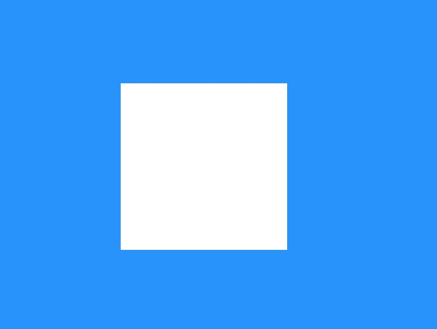
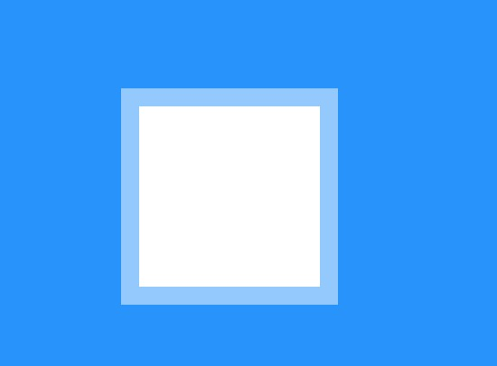
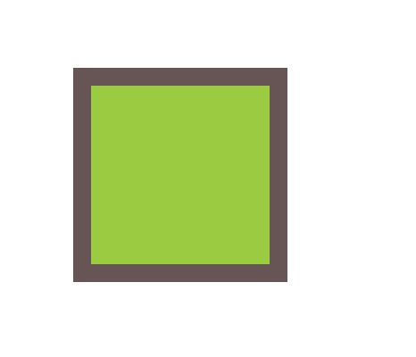
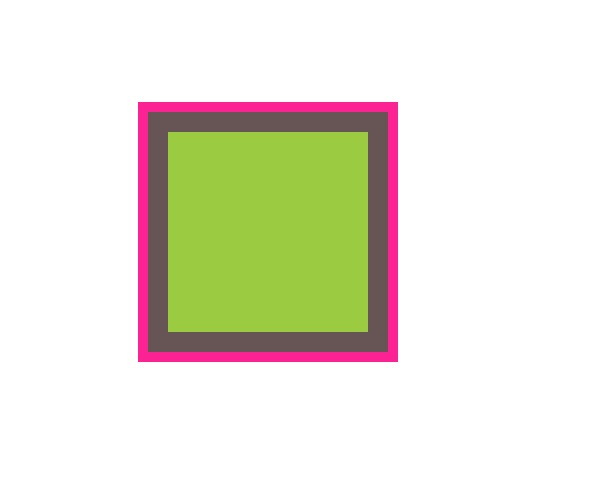
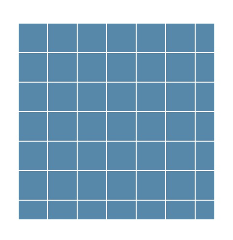
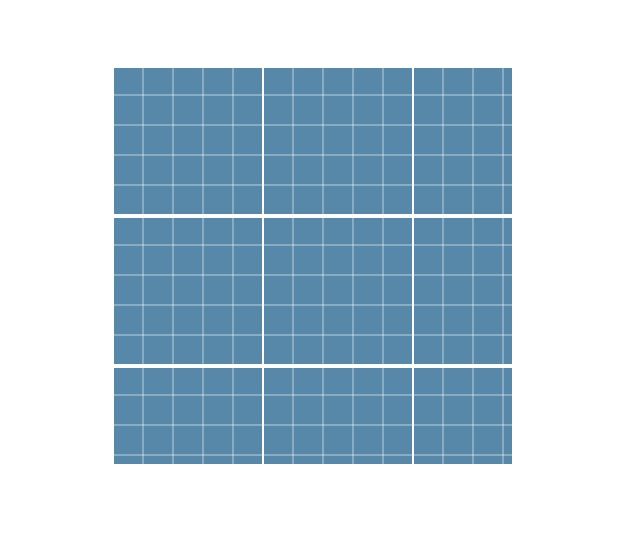

# 半透明边框
> 背景知识：RGBA/HSLA 颜色

## 难题
- 给一个容器设置一个白色背景和半透明的白色边框，body设置为非白色的背景
```CSS
body {
    background: dodgerblue;
}
div {
    width: 100px;
    height: 100px;
    margin: 100px;
    border: 10px solid hsla(0, 0%, 100%, .5);
    background: white;
}
```
- 结果并没有透过半透明的边框看到body的背景色



## 解决方案
- css2.1 中 背景会延伸到边框所在区域下层
- 从背景与边框第三版开始，可以通过`background-clip`属性来调整，初始值是`border-box`，设置为`padding-box`可以解决上述问题
```CSS
body {
    background: dodgerblue;
}
div {
    width: 100px;
    height: 100px;
    margin: 100px;
    border: 10px solid hsla(0, 0%, 100%, .5);
    background: white;
    background-clip: padding-box;
}
```



## 相关规范
- [CSS背景与边框](http://w3.org/TR/css-backgrounds)

# 多重边框
> 背景知识：box-shadow的基本用法

## 难题
- 目前还不能像使用多重背景那样使用多重边框


## box-shadow方案
- 设置两个为零的偏移量以及为零的模糊值，设置第四个参数扩张半径，得到像一道实线的边框
- 支持逗号分隔语法，既可以创建任意数量的投影
- 需要注意box-shadow是层层叠加，第一层投影位于最顶层，依次类推
```CSS
div {
    margin: 100px;
    width: 100px;
    height: 100px;
    background: yellowgreen;
    box-shadow: 0 0 0 10px #655;
}
```


```CSS
div {
    margin: 100px;
    width: 100px;
    height: 100px;
    background: yellowgreen;
    box-shadow: 0 0 0 10px #655, 0 0 0 15px deeppink;
}
```




### 注意事项
- 投影的行为和边框不完全一致，投影不会影响布局，不会受到`box-sizing`属性的影响。可通过内边距或外边距来额外模拟出边框所需要占据的空间
- 不会响应鼠标事件，比如悬停或点击。可以给`box-shadow`属性加上`inset`关键字，来使投影回执在元素的内圈。需增加额外的内边距腾出足够的空隙。

## outline方案
- 只需要两层边框，可以设置一层常规边框，再加上outline来产生外层的边框
```CSS
 div {
    width: 300px;
    height: 300px;
    margin: 100px;
    background: yellowgreen;
    border: 10px solid #655;
    outline: 5px solid deeppink;
}
```

### 优点
- 可以模拟虚线边框
- 可通过`outline-offset`属性来控制它跟元素边缘之间的间距

### 注意事项
- `outline`并不能接受用逗号分隔的多个值
- 边框不一定会贴合`border-radius`属性产生的圆角（未来可能会改成贴合`border-radius`圆角
- 根据CSS基本UI特性（第三版）规范所述，描边可以不是矩形。尽管在绝大数情况下，描边都是矩形，最好在不同浏览器中完整地测试最终效果


## 相关规范
- [CSS背景与边框](http://w3.org/TR/css-backgrounds)
- [CSS基本UI特性](http://w3.org/TR/css3-ui)

# 灵活的背景定位

## 难题

## background-position的扩展语法方案
- 允许指定背景图片距离任意角的偏移量，只要在便宜量前面指定关键字

```CSS
div {
    width: 200px;
    height: 200px;
    background: url(code-priate.svg) no-repeat #58a;
    background-positon:right 20px bottom 10px;
}
```
- 回退方案：将老套的bottom right定位值写进background的简写属性中

```CSS
div {
    width: 200px;
    height: 200px;
    background:url(code-priate.svg) no-repeat bottom right #58a;
    background-positon:right 20px bottom 10px;
}
```

## background-origin 方案
- 给背景图片设置距离某个角的偏移量，如果偏移量与容器的内边距一致，采用background-position扩展语法代码看起来如下：

```CSS
padding: 10px;
background: url(code-pirate.svg) no-repeat #58a;
background-postion: right 10px bottom 10px;
```
- 虽然起作用了但是代码不够DRY，每次改动内边距的值时，需要再三个地方更新这个值
- 默认情况background-postion以padding box为准，这样边框不会遮住背景图片
- background-origin可以改变这种行为

```CSS
padding: 10px;
background:url("code-pirate.svg") no-repeat # 58a bottom right;
background-origin: content-box;
```

## calc() 方案
```CSS
background:url("code-pirate.svg") no-repeat;
background-postion: calc(100% - 20px) calc(100% -10px);
```

> 不要忘记`calc()`函数内部的`-`和`+`运算符的两侧各加一个空白，否则会产生解析错误！这个规则如此怪异，是为了向前兼容：未来，在`calc()`内部可能会允许使用关键字，而这些关键字可能会包含连字符（即减号）


## 相关规范
- [CSS背景与边框](http://w3.org/TR/css-backgrounds)
- [CSS值与单位](http://w3.org/TR/css-values)

# 边框内圆角
> 背景知识：box-shadow、outline、多重边框

## 难题
有时我们需要一个容器，只有内侧有圆角，而边框或描边的四个角在外部仍然保持直角的形状。这种效果一般需要两个元素实现，如何一个元素达到同样的效果

## 解决方案
- 有点hack味道的解决方案 ，依赖于描边不跟着圆角走（未来可能改变）

```CSS
background: tan;
border-raduis: .8em;
padding: 1em;
box-shadow: 0 0 0 .6em #655;
outline: .6em solid #655;
```

- 限制：扩展半径需要比描边的宽度小，又要比(√2-1)r大（r代表border-radius）
- 如果描边宽度比(√2-1)r小，就无法达成效果

## 相关规范
- [CSS背景与边框](http://w3.org/TR/css-backgrounds)
- [CSS基本UI特性](http://w3.org/TR/css3-ui)


# 条纹背景
> 背景知识：CSS线性渐变、background-size

## 难题
- 一般都是用图片

## 解决方案
- 使用线性渐变，将两个色标重合
- 如果多个色标具有相同的位置，他们会产生一个无限小的过渡区域，过渡的起止色分别是第一个和最后一个指定值。从效果上看，颜色会从那个位置突然变化，而不是一个平滑的渐变过程
- 避免每次改动条纹宽度时都要修改两个数字，可以从规范里找到捷径
  * 如果某个色标的位置值比整个列表中在它之前的色标的位置都要小，则该色标的位置值会被设置为它前面所有色标位置值的最大值

## 垂直条纹
- 调整渐变方向

```
background: linear-gradient(to right, #fb3 50%, #58a 0);
background-size: 30px 100%;
```

## 斜向条纹
- 增加一些颜色，旋转，实现无缝对接
- 条纹的宽度可以根据勾股定理计算然后设置`background-size`的值

## 更好的斜向条纹
- 循环式加强版：`repeating-linear-gradient()`和`repeating-radial-gradient()`
- 色标是无限循环重复的，直到填满整个背景

```
background: repeating-linear-gradient(45deg, #fb3, #fb3 15px, #58a 0, #58a 30px);
```

- 创建双色条纹时都需要用到四个色标
- 最好用前面的方法实现水平或垂直的条纹
- 用这种方法来实现斜向条纹
- 45°条纹可以用两种方法结合，通过重复线性渐变来简化贴片的代码

```
background: repeating-linear-gradient(45deg, #fb3 0, #fb3 25%, #58a 0, #58a 50%);
background-size: 42.426406871px, 42.426406871px;
```

## 灵活的同色系条纹
- 大多数情况下想要的条纹图案并不是由差异极大的几种颜色组成的，这些颜色往往属于同一色系，只是在明度方面有着轻微的差异，如下

```
background: repeating-linear-gradient(30deg, #79b, #79b 15px, #58a 0, #58a 30px);
```


- 不为每种条纹单独指定颜色，而是把最深的颜色指定为背景色，同时把半透明白色的条纹叠加在背景色上来得到浅色条纹

```
background: #58a;
background-image: repeating-linear-gradient(30deg, hsla(0, 0%, 100%, .1), hsla(0, 0%, 100%, .1) 15px, transparent 0, transparent 30px);
```
- 这样只需要修改一个地方就可以改变所有颜色，对于不支持css渐变的浏览器，背景色还起到了回退的作用

## 相关规范
- [CSS图像](http://w3.org/TR/css-images)
- [CSS背景与边框](http://w3.org/TR/css-backgrounds)
- [CSS图像第四版](http://w3.org/TR/css4-images)


# 复杂的背景图案
> 背景知识：CSS渐变，条纹背景

## 难题
- 还需要很多其他不同类型的团，比如：网格、波点、棋盘等


## 网格
- 多个渐变图案组合起来
```CSS
div {
    width: 200px;
    height: 200px;
    margin: 100px;
    background:white;
    background-image: linear-gradient(90deg, rgba(200, 0, 0, .5) 50%, transparent 0), linear-gradient(rgba(200,0,0,.5) 50%, transparent 0);
    background-size: 30px 30px;
}
```

- 某些情况希望 * 网格中每个格子的大小可以调整，而网格线条的粗细同时保持固定 * ，可以*使用长度而不是百分比*作为色标
```CSS
div {
    width: 200px;
    height: 200px;
    margin: 100px;
    background: #58a;
    background-image: linear-gradient(white 1px, transparent 0), linear-gradient(90deg, white 1px, transparent 0);
    background-size: 30px 30px;
}
```


- 可以把两幅不同线宽、不同颜色的网格团叠加起来，得到一个更加逼真的蓝图网格
```CSS
 div {
    width: 200px;
    height: 200px;
    margin: 100px;
    background: #58a;
    background-image: linear-gradient(white 2px, transparent 0),
    linear-gradient(90deg, white 1px, transparent 0),
    linear-gradient(hsla(0,0%,100%,.3) 1px, transparent 0),
    linear-gradient(90deg, hsla(0,0%,100%,.3) 1px, transparent 0);
    background-size: 75px 75px, 75px 75px, 15px 15px, 15px 15px;
}
```


[试一试](blueprint.html)

[CSS3图案库](https://leaverou.github.io/css3patterns/)


## 波点