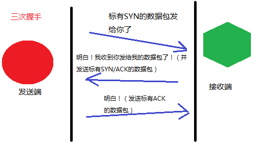
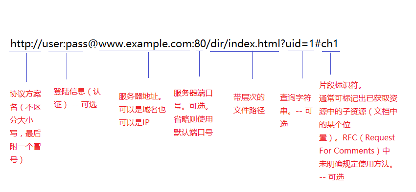
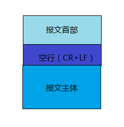

# 网络基础TCP/IP
## TCP/IP的分层管理
- 应用层
- 传输层
- 网络层
- 数据链路层

# 与HTTP关系密切的协议
## 负责传输的IP协议
- 使用ARP协议凭借MAC地址进行通信

## 确保可靠性的TCP协议
- 三次握手
    * 发送端首先发送一个带有SYN标识的数据包给对方
    * 接收端收到后，回传一个带有SYN/ACK标识的数据包以示传达确认信息
    * 发送端再回传一个带有ACK标识的数据包，代表“握手”结束。
- TCP的标志（flag）
    * SYN synchronize
    * ACK acknowledgement



## 负责域名解析的DNS服务
- Domain Name System
- 应用层协议
- 提供域名到IP地址之间的解析服务

# URI 和 URL
- Uniform Resource Identifier 统一资源标识符
- Uniform Resource Locator 统一资源定位符

URI用字符串标识某一互联网资源，URL表示资源的地点



# HTTP协议
## HTTP协议用于客户端和服务器端之间的通信
## 通过请求和响应的交换达成通信
## HTTP是不保存状态的协议
- 协议自身不具备保存之前发送过的请求或响应的功能

## 请求URI定位资源
- URI为完整的请求URI

```HTTP
GET http://hello.com/index.html HTTP/1.1
```

- 在首部字段Host中写明域名或IP地址

```HTTP
GET /index.html HTTP/1.14
Host: hello.com
```

- 对服务器本身发起请求，可用`*`来代替请求的URI

```HTTP
OPTIONS * HTTP/1.1
```
## 告知服务器意图的HTTP方法
- GET 获取资源
- POST 传输实体主体
- PUT 传输文件
    * HTTP/1.1 的PUT方法自身不带验证机制，存在安全性问题。
- HEAD 获得报文首部
    * 用于确认URI的有效性及资源更新的日期时间等
- DELETE 删除文件
- OPTIONS 询问支持的方法
    * 用来查询针对请求URI指定的资源支持的方法
- TRACE 追踪路径
    * 发送请求时，在Max-Forwards首部字段填入数值，每经过一个服务器减1，减到0时，停止传输，最后接受到请求的服务器则返回状态码200 OK的响应
    * 不常用，且会引发XST（Cross-Site Tracing，跨站追踪）攻击
- CONNECT 要求用隧道协议连接代理
    * 要求在与代理服务器通信时建立隧道
    * 主要使用SSL（Secure Sockets Layer，安全套接层）、TSL（Transport Layer Security，传输层安全）协议把通信内容加密后经网络隧道传输

```HTTP
CONNECT 代理服务器名 : 端口号 HTTP版本

CONNECT proxy.hello.com:8080 HTTP/1.1
```

## 使用方法下达命令
- 方法名要用大写字母

## 持久连接节省通信量
- 持久连接
    * 只要任意一端没有明确提出断开连接，则保持TCP连接状态
- 管线化

## 使用Cookie的状态管理

# HTTP报文
- 报文首部
    * 服务器端或客户端需处理的请求或响应的内容及属性
- CR +　LF
    * CR Carriage Return 回车 16进制 0x0d
    * LF Line Feed 换行符 16进制 0x0a
- 报文主体
    * 应被发送的数据
    * 并不一定要有报文主体



# 请求报文及响应报文的结构
- 请求报文首部
    * 请求行
        - 包含用于请求的方法，请求URI和HTTP版本
    * 请求首部字段
        - 包含表示请求和响应的各种条件和属性的各类首部
    * 通用首部字段
    * 实体首部字段
    * 其他
        - 可能包含HTTP的RFC里未定义的首部（Cookie等）
- 响应报文首部
    * 状态行
        - 包含表明响应结果的状态码，原因短语和HTTP版本
    * 响应首部字段
    * 通用首部字段
    * 实体首部字段
    * 其他

# 编码提升传输速率
常用的内容编码
- gzip （GNU zip）
- compress(UNIX 系统的标准压缩)
- deflate（zlib）
- identity（不进行编码）

## 分块传输编码（Chunked Transfer Coding）

# 发送多种数据的多部分对象集合
- multipart/form-data
    * 在web表单文件上传时使用
- multipart/byteranges
    * 状态码206（Partial Content，部分内容）响应报文包含了多个范围的内容时使用

# 获取部分内容的范围请求
- 用首部字段Range来指定资源的byte范围
- 响应会返回状态码为206 Partial Content的响应报文
```HTTP
Range: bytes=5001-10000

Range: bytes=5001-

Range: bytes=-3000, 5000-7000
```

# 内容协商返回最合适的内容
- 内容协商会以响应资源的语言、字符集、编码方式等作为判断的基准
- 内容协商有3中类型
    * 服务器驱动协商 Server-driven Negotiation
        + 以请求的首部字段为参考，在服务器端自动处理
    * 客户端驱动协商 Agent-driven Negotiation
    * 透明协商 Transparent Negotiation
        + 服务器驱动和客户端驱动的结合体，由服务器和客户端各自进行内容协商

# 状态码
- 以3位数字和原因短语组成  `200 OK`
- 数字第一位指定了响应类别，后两位无分类
    * 1XX information（信息性状态码） 接受的请求正在处理
    * 2XX success （成功状态码） 请求正常处理完毕
        + 200 OK 请求正常处理
        + 204 No Content 请求处理成功，但没有资源可返回 （返回的响应报文不含实体的主体部分）
        + 206 Partial Content 客户端进行了范围请求。响应报文中有Content-Range 指定范围的实体内容

    * 3XX redirection（重定向状态码）需要进行附加操作以完成请求
        + 301 Moved Permanently 永久重定向 表示请求的资源已被分配了新的URI，以后应使用资源现在所指的URI。
            * 如果把资源对象的URI保存为书签，这时应该按Location首部字段提示的URI重新保存
        + 302 Found 临时性重定向 表示请求的资源已被分配了新的URI，希望用户本次能使用新的URI访问
        + 303 See Other 表示由于请求对应的资源存在着另一个URI，应使用GET方法定向获取请求的资源
            * 返回301、302、303状态码，几乎所有的浏览器都会把POST改成GET，并删除请求报文内的主体，之后请求会自动再次发送。301、302标准是禁止将POST方法改变成GET方法的，但实际使用时大家都会这么做
        + 304 Not Modified 表示客户端发送附带条件的请求时，服务器端允许请求访问资源，但因发生请求未满足条件，直接返回304.（服务器端资源为改变，可直接使用客户端未过期的缓存）
            * 附带条件的请求时指采用GET方法的请求报文中包含：If-Math、If-Modified-Since、If-None-Match、If-Range、If-Unmodified-Since中任一首部
        + 307 Temporary Redirect 临时重定向，跟302有相同含义。302禁止POST变换成GET，但实际使用时大家并不遵守。307标准不会从POST变成GET
    * 4XX client error （客户端错误状态码）服务器无法处理请求
        + 400 Bad Request 请求报文中存在语法错误
        + 401 Unauthorized 表示发送的请求需要通过HTTP认证（BASIC认证、DIGEST认证）的认证信息
        + 403 Forbidden 表明对请求资源的访问被服务器拒绝了
        + 404 Not Found 服务器上无法找到请求的资源。也可以再服务端拒绝请求，且不想说明理由时使用
    * 5XX server error （服务器错误状态码）服务器处理请求出错
        + 500 Internal Server Error 服务器端再执行请求发生了错误
        + 503 Service Unavailable 服务器暂时处于超负载或正在进行停机维护，现在无法处理请求
