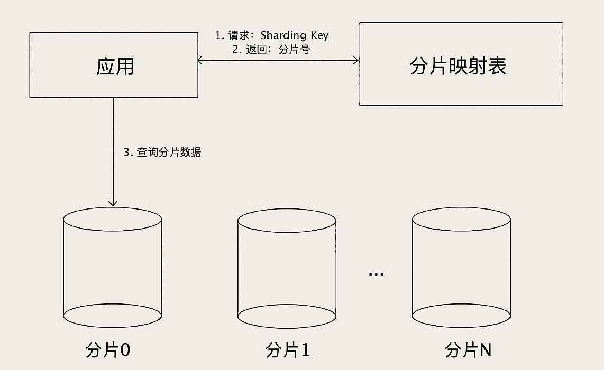

解决海量数据的问题，必须要用到分布式的存储集群，因为 MySQL 本质上是一个单机数据库，所以很多场景下不是太适合存 TB 级别以上的数据。但是，绝大部分的电商大厂，它的在线交易这部分的业务，比如说，订单、支付相关的系统，还是舍弃不了 MySQL，原因是，只有 MySQL 这类关系型数据库，才能提供金融级的事务保证。我们之前也讲过分布式事务，那些新的分布式数据库提供的所谓的分布式事务，多少都有点儿残血，目前还达不到这些交易类系统对数据一致性的要求。

那既然 MySQL 支持不了这么大的数据量，这么高的并发，还必须要用它，怎么解决这个问题呢？还是按照我上节课跟你说的思想，分片，也就是拆分数据。1TB 的数据，一个库撑不住，我把它拆成 100 个库，每个库就只有 10GB 的数据了，这不就可以了么？这种拆分就是所谓的 MySQL 分库分表。

# 如何规划分库分表？
- 原则
  * 那就是能不拆就不拆，能少拆不多拆。
  
- 目的
  * 第一，是数据量太大查询慢的问题。这里面我们讲的“查询”其实主要是事务中的查询和更新操作，因为只读的查询可以通过缓存和主从分离来解决，这个我们在之前的“MySQL 如何应对高并发”的两节课中都讲过。那我们上节课也讲到过，解决查询慢，只要减少每次查询的数据总量就可以了，也就是说，分表就可以解决问题。
  * 第二，是为了应对高并发的问题。应对高并发的思想我们之前也说过，一个数据库实例撑不住，就把并发请求分散到多个实例中去，所以，解决高并发的问题是需要分库的。
  
- 数据量大，就分表；并发高，就分库
- 一般情况下，我们的方案都需要同时做分库分表，这时候分多少个库，多少张表，分别用预估的并发量和数据量来计算就可以了。

- 越简单的设计可靠性越高

# 如何选择 Sharding Key？
- 分库分表还有一个重要的问题是，选择一个合适的列或者说是属性，作为分表的依据，这个属性一般称为 Sharding Key
- 选择这个 Sharding Key 最重要的参考因素是，我们的业务是如何访问数据的。
- 分片之后无法兼容的查询，把订单数据同步到其他的存储系统中去，在其他的存储系统里面解决问题。比如说，我们可以再构建一个以店铺 ID 作为 Sharding Key 的只读订单库，专门供商家来使用。或者，把订单数据同步到 HDFS 中，然后用一些大数据技术来生成订单相关的报表。
- 分库分表一定是，数据量和并发大到所有招数都不好使了，我们才拿出来的最后一招。

# 如何选择分片算法？
- 基于范围来分片
  * 容易产生热点问题
  * 对查询非常友好，基本上只要加上一个时间范围的查询条件，原来该怎么查，分片之后还可以怎么查。范围分片特别适合那种数据量非常大，但并发访问量不大的 ToB 系统。
  * 比如说，电信运营商的监控系统，它可能要采集所有人手机的信号质量，然后做一些分析，这个数据量非常大，但是这个系统的使用者是运营商的工作人员，并发量很少。这种情况下就很适合范围分片。
- 哈希分片算法
  * 取模
  * 一致性哈希
- 查表法
  * 查表法其实就是没有分片算法，决定某个 Sharding Key 落在哪个分片上，全靠人为来分配，分配的结果记录在一张表里面。每次执行查询的时候，先去表里查一下要找的数据在哪个分片中。
  * 分片映射表本身的数据不能太多，否则这个表反而成为热点和性能瓶颈了。
  * 查表法相对其他两种分片算法来说，缺点是需要二次查询，实现起来更复杂，性能上也稍微慢一些。但是，分片映射表可以通过缓存来加速查询，实际性能并不会慢很多。

    

# 小结
- 对 MySQL 这样的单机数据库来说，分库分表是应对海量数据和高并发的最后一招，分库分表之后，将会对数据查询有非常大的限制。
- 分多少个库需要用并发量来预估，分多少表需要用数据量来预估。选择 Sharding Key 的时候，一定要能兼容业务最常用的查询条件，让查询尽量落在一个分片中，分片之后无法兼容的查询，可以把数据同步到其他存储中去，来解决这个问题。
- 我们常用三种分片算法，范围分片容易产生热点问题，但对查询更友好，适合适合并发量不大的场景；哈希分片比较容易把数据和查询均匀地分布到所有分片中；查表法更灵活，但性能稍差。对于订单表进行分库分表，一般按照用户 ID 作为 Sharding Key，采用哈希分片算法来均匀分布用户订单数据。为了能支持按订单号查询的需求，需要把用户 ID 的后几位放到订单号中去。
- 最后还需要强调一下，我们这节课讲的这些分片相关的知识，不仅仅适用于 MySQL 的分库分表，你在使用其他分布式数据库的时候，一样会遇到如何分片、如何选择 Sharding Key 和分片算法的问题，它们的原理都是一样的，所以我们讲的这些方法也都是通用的。

# 思考题
- 把订单表拆分之后，那些和订单有外键关联的表，该怎么处理？