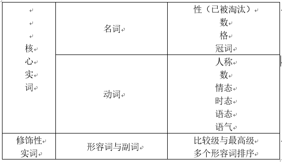

# 简单句
学习英语语法的目的？
造句
为了方便研究，拆掉长句子，留下不能再拆的基本句，称作为简单句（Simple sentence）
简单句结构：什么+怎么样
称为：句子成分
几乎所有句子结构：主语+谓语
主语：人或物
谓语：广义的动作或发生了什么事

有哪些动作（动词 verbs）
- 1. 可以独立完成的动作 不及物动词
  * 句子结构：主语 + 不及物动词
- 2. 有一个动作的承受者（宾语） 及物动词
  * 句子结构：主语 + (单)及物动词 + 宾语
- 3. 有两个动作承受者 双及物动词
  * 句子结构： 主语 + 双及物动词 + 就间接宾语 + 直接宾语
- 4. 有一个动作承受者
  * 主语 + 复杂及物动词 + 宾语 + 宾语补语
- 5. 不是一个动作
  * 像is 这样的词为代表的一类词，作用就是把这个词后面的信息赋予给前面的词（称为Linking Verbs [连]系动词）
  * 主语 + 系动词 + 主语补语（表语）
  
# 句子成分

1. 主语
2. 谓语动词
3. 宾语
4. 宾语补语
5. 主语补语（表语）
6. 定语
  * 主要修饰宾语
7. 状语
  * 主要修饰谓语动词
8. 同位语 

# 简单句的组合
- 复合句/并列句 compound sentence
- 复杂句 complex sentence
  * 句子嵌套
  * 主句 + 从句
  * 名词性从句
     * 主语从句
     * 宾语从句
     * 表语从句
     * 同位语从句
  * 定语从句
  * 状语从句

# 词类
- 名词
- 冠词
- 代词
- 形容词
- 数词
- 副词
- 介词
- 叹词
- 连词
- 动词

# 谓语动词3大本领
1. 表示动作时间
   * 现在
   * 过去
   * 将来
   * 过去将来（从过去某个时间点“算将来”）
2. 表示动作状态
   * 一般
   * 完成
   * 进行
   * 完成进行（不但完成而且继续）
3. 表示动作的假设、情感等 （语气）

Tense Aspect Mood
TAM
时体气

# 助动词
- Auxiliary Verbs 帮助动词完成3大本领
- 助动词有：
    - have
    - be
    - can
    - might
    - do
    - must
- 做助动词无意义，不过很多助动词作为其他的有实义
    
# 非谓语动词
- 非谓语动词几乎可以取代所有从句，从而简化句子
- 存在形式
    - 动词不定式
      * to eat
    - 现在分词
      * eating
    - 动名词
      * eating
    - 过去分词
      * eaten

# 词性、成分与句子三者间的关系

> 成分词性并不绝对，但是为了快速理解整个语法体系，可以暂时将词性绝对化

# 四大实词主要涉及的语法项目
